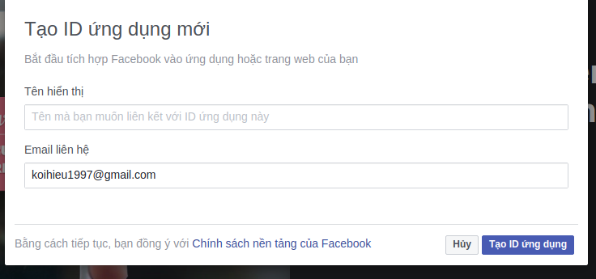

# Login facebook with Facebook SDK

### Thiết lập ứng dụng 
  - Truy cập trang [https://developers.facebook.com](https://developers.facebook.com) để tạo một ứng dụng   
  

  Tiếp theo vào **cài đặt** -> **Thông tin cơ bản** 
  

    
 Tại dòng `Miền ứng dụng` ta điền domain của ứng dụng ta cần login 

 Kéo gần xuống cuối `Thêm nền tảng`  

 
 
 Thêm url web
 

 Tiếp theo ta chọn vào `bắt đầu nhanh`
 
 

  Chúng ta cần phải để ý một vài đều sau 
- FB.init (Khởi tạo ứng dụng )
- appID là id của ứng dụng mình đã tạo 
- version là phiên bản của ứng dụng hiện tại là v3.2
- FB.login() đăng nhập facebook
- FB.logout() đăng xuất facebook  

Sau khi đăng nhập facebook ta có thể  lấy các thông tin mà người dùng public như name, id , email, first_name, last_name,...
Từ đó ta có thể lấy các thông tin này đẩy vào db và có thể tạo tài khoản người dùng cho user
